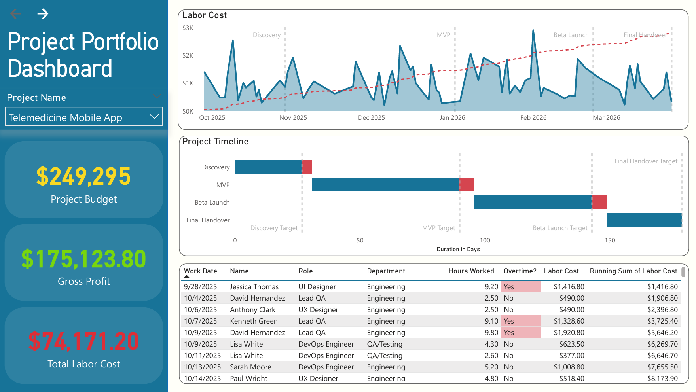
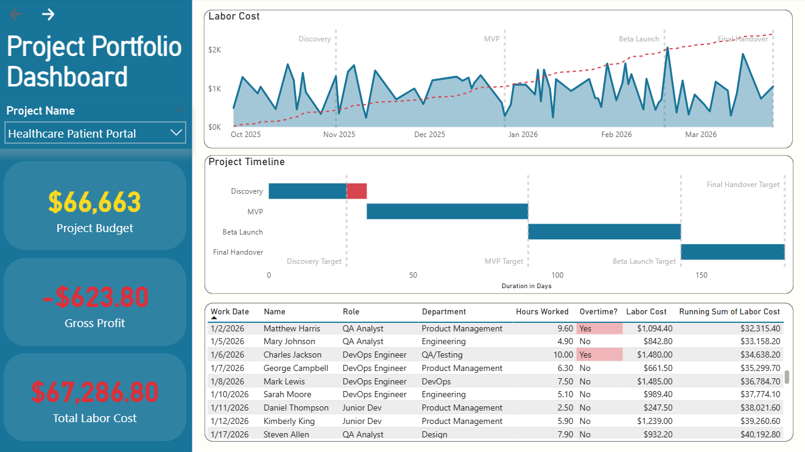

# 📊 Project Portfolio Dashboard
**Power BI | Digital Product Agency | Labor Cost & Profitability Tracking**

---

## Overview

A Power BI dashboard built to track **Project Health, Labor Costs, and Profitability** across a digital product agency spanning Engineering, Design, Product, QA, and DevOps departments. The dashboard enables stakeholders to monitor budget burn, milestone delays, overtime patterns, and per-phase labor costs — all filterable by individual project.

---

## Dashboard Preview

> Dashboard filtered to a single project, showing KPI cards, labor cost trend, Gantt chart, and audit table.

---

## Data Model

**Schema Type:** Star Schema — imported from SQL Server views

### Tables

| Table | Description |
|---|---|
| `Dim_Calendar` | Date dimension — Date, IsWeekday, Month, Quarter, Year |
| `Dim_Departments` | Department reference — DeptID, DeptName, AnnualOperatingBudget |
| `vw_EmployeeDetails` | Employee info — ID, Name, Role, HourlyRate, DeptID, EmploymentType, SeniorityLevel, Location, HireDate |
| `vw_ProjectDetails_clean` | Project info — ProjectID, ClientName, DeptID, Budget, StartDate, EndDate, Status, DurationDays |
| `vw_ProjectMilestones_clean` | Milestone tracking — MilestoneID, ProjectID, MilestoneName, TargetDate, ActualCompletionDate, IsDelayed, DaysDifference |
| `vw_ProjectLaborCosts` | Timesheet data — TimesheetID, ProjectID, EmployeeID, WorkDate, HoursWorked, HourlyRate, LaborCost, IsOvertime, PhaseName |

### Relationships

| From | To | Column | Cardinality | Active |
|---|---|---|---|---|
| `vw_ProjectLaborCosts` | `vw_ProjectDetails_clean` | ProjectID | Many-to-1 | ✅ |
| `vw_ProjectLaborCosts` | `vw_EmployeeDetails` | EmployeeID | Many-to-1 | ✅ |
| `vw_ProjectDetails_clean` | `Dim_Departments` | DeptID | Many-to-1 | ✅ |
| `vw_EmployeeDetails` | `Dim_Departments` | DeptID | Many-to-1 | ❌ Inactive — use `USERELATIONSHIP()` in DAX when needed |
| `Dim_Calendar` | `vw_ProjectMilestones_clean` | Date / TargetDate | 1-to-Many | ✅ |
| `vw_ProjectDetails_clean` | `vw_ProjectMilestones_clean` | ProjectID | 1-to-Many | ✅ |

---

## Calculated Columns

### `vw_ProjectMilestones_clean`

**`PhaseStartDate`** — Derives the start date of each phase by chaining milestone completion dates sequentially.

**`PhaseDuration`** — Integer difference between ActualCompletionDate and PhaseStartDate.

**`MilestoneOrder`** — Numeric sort order (1–4) for Discovery → MVP → Beta Launch → Final Handover.

### `vw_ProjectLaborCosts`

**`PhaseName`** — Maps each timesheet WorkDate to a project phase (Discovery / MVP / Beta Launch / Final Handover / Unclassified) using `SWITCH(TRUE(), ...)` against phase date ranges per project.

**`EmployeeName`**, **`EmployeeRole`**, **`EmployeeDept`** — Denormalized via `RELATED()` from `vw_EmployeeDetails` to ensure correct row-level filtering in the audit table without requiring bidirectional relationships.

---

## DAX Measures

### Core Financials

| Measure | Description |
|---|---|
| `Total Labor Cost` | `SUM` of all labor costs |
| `Gross Profit` | Project budget minus Total Labor Cost |
| `Burn Rate %` | Total Labor Cost divided by project budget |
| `Running Total Labor Cost` | Cumulative labor cost scoped to selected project via `ALLSELECTED` |

### Gantt Chart

| Measure | Description |
|---|---|
| `Gantt Offset` | Days from project start to phase start (invisible bar segment) |
| `Gantt Duration - On Time` | Length of on-time portion of each phase |
| `Gantt Duration - Delayed` | Length of delayed portion beyond target date |
| `Gantt Target Line - Discovery/MVP/Beta Launch/Final Handover` | Constant lines marking target dates relative to project start |

### Tooltips

| Measure | Description |
|---|---|
| `Tooltip - Status` | Returns "On-Time" or "Delayed" per phase |
| `Tooltip - Duration (On-Time)` | On-time phase length as string with " days" suffix |
| `Tooltip - Days Delayed` | Delay length as string with " days" suffix |
| `Tooltip - Phase Labor Cost` | Labor cost filtered to the hovered milestone phase |

### Conditional Formatting

| Measure | Description |
|---|---|
| `Tooltip Formatting - DaysDelayed` | Returns `#DF2E38` (red) if delayed, `#000000` (black) if on time |

---

## Dashboard Layout

### Left Sidebar
- Project Name slicer (single select)
- KPI Cards: Allocated Budget · Gross Profit · Total Labor Cost (conditional color formatting)

### Top Row
- **Line Chart** — Daily labor cost over time with phase reference lines (Discovery, MVP, Beta Launch, Final Handover) and a budget ceiling trendline
- **Bar Chart** — Labor cost breakdown by department

### Middle
- **Gantt Chart** (Stacked Bar) — Project timeline per phase showing on-time vs. delayed segments, target date constant lines, and a custom tooltip page

### Bottom
- **Audit Detail Table** — WorkDate, Name, Role, Department, Hours Worked, Overtime?, Labor Cost, Running Sum of Labor Cost

---

## Gantt Chart Setup

| Setting | Value |
|---|---|
| Visual type | Stacked Bar Chart |
| Y-axis | `MilestoneName` sorted by `MilestoneOrder` ASC |
| Values | `Gantt Offset` → `Gantt Duration - On Time` → `Gantt Duration - Delayed` |
| Colors | Offset = canvas background · On Time = Green · Delayed = Red |
| Constant Lines | 4 target date lines (one per milestone) in Red/dashed |
| Tooltip | Custom report page (`Gantt Tooltip`) |

### Gantt Tooltip Page — 7 Cards

| Card | Content |
|---|---|
| 1 | Milestone Name |
| 2 | Status (On-Time / Delayed) — color formatted |
| 3 | Target Date |
| 4 | Actual Completion Date |
| 5 | Duration (On-Time) in days |
| 6 | Days Delayed — color formatted red if > 0 |
| 7 | Phase Labor Cost — formatted as currency |

---

## Key Lessons Learned

- In calculated columns, use bare column references (`Table[Column]`) for row context — not `MAX()` unless resolving an ambiguity error
- `SWITCH(TRUE(), ...)` is the correct pattern for non-overlapping date range conditions
- Power BI conditional formatting only accepts **hex color codes** — not named colors like `"Black"`
- Measures returning strings (e.g. `& " days"`) must be compared against the full string (e.g. `"0 days"`), not numerically
- `SELECTEDVALUE()` breaks row-level filtering in table visuals — use `MAX()` instead
- Bidirectional cross-filter relationships can cause "Resources Exceeded" errors — prefer denormalizing via `RELATED()` calculated columns instead
- Employee dimension columns used in a table visual must be sourced from the fact table (via `RELATED()`) to correctly inherit slicer filter context

---

## Project Status

| Component | Status |
|---|---|
| Data Model & Relationships | ✅ Complete |
| Calculated Columns | ✅ Complete |
| Core DAX Measures | ✅ Complete |
| Gantt Chart + Tooltip | ✅ Complete |
| KPI Cards | ✅ Complete |
| Line & Bar Charts | ✅ Complete |
| Audit Detail Table | ✅ Complete |
| Weighted CPI Measure | ⏳ Future enhancement |

---

## Built With

- **Power BI Desktop**
- **DAX** (Data Analysis Expressions)
- **SQL Server** (source views)

---

*Built as a junior data analyst project under self-learning method.*